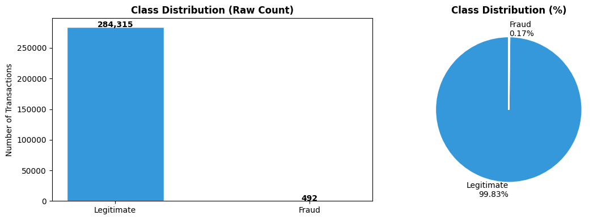
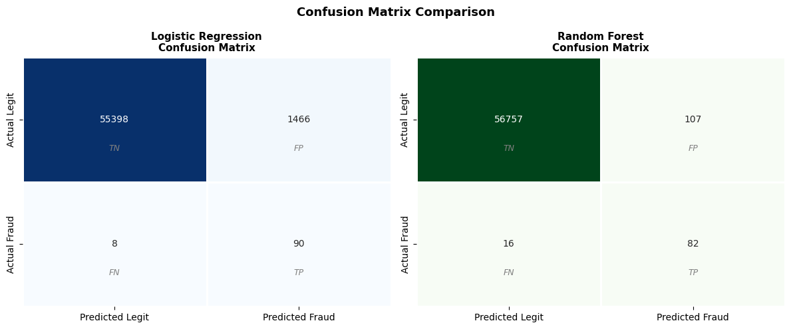
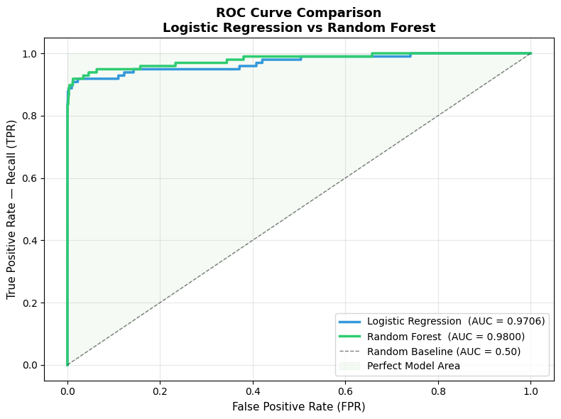

# DecodeLabs_Task02_UdamIlukpotha

# 💳 Project 2: Supervised Learning — Fraud Detection Pipeline
### Real Kaggle Credit Card Fraud Dataset | DecodeLabs Industrial Training — Batch 2026

***

## 📥 Dataset Download

**Dataset:** Credit Card Fraud Detection (ULB Machine Learning Group)

👉 **Download here:** https://www.kaggle.com/datasets/mlg-ulb/creditcardfraud

**Steps:**
1. Create a free account at [kaggle.com](https://www.kaggle.com)
2. Visit the link above and click **Download** → `creditcard.csv` (~144MB)
3. Place `creditcard.csv` in the **same folder** as your notebook

***

## Project Overview

This project is **Project 2** of the DecodeLabs Data Science Industrial Training Kit (Batch 2026). The objective is to build a production-grade, leak-free supervised learning pipeline to detect fraudulent credit card transactions in a highly imbalanced real-world dataset.

**Dataset Stats:**
- **284,807** total transactions
- **492** confirmed fraud cases (**0.17%** of total)
- **28** PCA-transformed features (V1–V28) + `Amount`
- Source: European cardholders, September 2013

***

## Class Distribution

| Class | Count | Percentage |
|-------|-------|------------|
| Legitimate (0) | 284,315 | 99.83% |
| Fraud (1) | 492 | 0.17% |

The extreme imbalance (578:1 ratio) is why standard Accuracy is a useless metric for this problem.




***

## Evaluation Metrics

| Metric | Formula | Why It Matters |
|--------|---------|---------------|
| **Precision** | TP ÷ (TP + FP) | When we flag fraud, are we right? |
| **Recall** | TP ÷ (TP + FN) | Did we catch ALL real fraud? |
| **F1-Score** | 2 × (P × R) ÷ (P + R) | Harmonic balance of both |
| **ROC-AUC** | Area under ROC curve | Overall separation power |
| ~~Accuracy~~ | ~~Correct ÷ Total~~ | ~~Discarded — misleading on imbalanced data~~ |

***

## Results

### Logistic Regression

| Class | Precision | Recall | F1-Score | Support |
|-------|-----------|--------|----------|---------|
| Legitimate | 1.00 | 0.97 | 0.99 | 56,864 |
| **Fraud** | **0.06** | **0.92** | **0.11** | **98** |
| Accuracy | | | 0.97 | 56,962 |
| Macro Avg | 0.53 | 0.95 | 0.55 | 56,962 |

**Confusion Matrix:**
- True Negatives (Correct Legitimate): **55,398**
- True Positives (Fraud Caught): **90**
- False Positives (False Alarms): **1,466**
- False Negatives (Missed Fraud): **8**

**ROC-AUC: 0.9706**

**Analysis:** Logistic Regression achieves excellent Recall (0.92) — it catches 90 out of 98 fraud cases, missing only 8. However, Precision is very low (0.06) meaning it raises 1,466 false alarms. In a real bank, this would mean thousands of legitimate customers getting their cards declined daily. The SMOTE + class weighting successfully pushed the model to be aggressive about finding fraud.

***

### Random Forest

| Class | Precision | Recall | F1-Score | Support |
|-------|-----------|--------|----------|---------|
| Legitimate | 1.00 | 1.00 | 1.00 | 56,864 |
| **Fraud** | **0.43** | **0.84** | **0.57** | **98** |
| Accuracy | | | 1.00 | 56,962 |
| Macro Avg | 0.72 | 0.92 | 0.79 | 56,962 |

**Confusion Matrix:**
- True Negatives (Correct Legitimate): **56,757**
- True Positives (Fraud Caught): **82**
- False Positives (False Alarms): **107**
- False Negatives (Missed Fraud): **16**

**ROC-AUC: 0.9800**

**Analysis:** Random Forest achieves a much stronger balance. Precision jumps to 0.43 — dramatically reducing false alarms from 1,466 down to just 107. Recall is 0.84, catching 82 of 98 fraud cases. The F1-Score of 0.57 is significantly better than Logistic Regression's 0.11, reflecting a far more operationally viable model.





***

## Model Comparison

| Metric | Logistic Regression | Random Forest | Winner |
|--------|--------------------|-|--------|
| Precision (Fraud) | 0.06 | **0.43** | ✅ Random Forest |
| Recall (Fraud) | **0.92** | 0.84 | ✅ Logistic Regression |
| F1-Score (Fraud) | 0.11 | **0.57** | ✅ Random Forest |
| ROC-AUC | 0.9706 | **0.9800** | ✅ Random Forest |
| False Positives | 1,466 | **107** | ✅ Random Forest |
| False Negatives | **8** | 16 | ✅ Logistic Regression |

### 🏆 Recommended Model: Random Forest

**Random Forest is the better production model** for this use case. Its ROC-AUC of 0.9800 reflects stronger overall separation capability. Critically, it generates only 107 false alarms vs 1,466 for Logistic Regression — a 93% reduction in customer friction. It misses 16 frauds vs 8 for LR, but this trade-off is operationally acceptable given the massive reduction in false positives.

> **Key insight:** Logistic Regression has higher Recall but at the cost of flooding the fraud review team with 1,466 false alarms per test set. Random Forest strikes the right balance between catching fraud and not disrupting legitimate customers.

***

## ROC Curve Analysis

Both models significantly outperform the random baseline (AUC = 0.50):

- **Logistic Regression AUC: 0.9706** — strong, but the linear decision boundary limits performance on the complex fraud pattern space
- **Random Forest AUC: 0.9800** — the non-linear ensemble boundary captures fraud patterns more precisely

Both curves hug the top-left corner of the ROC space — indicating excellent separation capability across all decision thresholds.

***

## Pipeline Architectures

### Pipeline 1: Logistic Regression
```
StandardScaler → SMOTE → LogisticRegression(class_weight='balanced')
```
- StandardScaler normalizes all features to mean=0, std=1 (mandatory for LR)
- SMOTE synthesizes new fraud examples on training data only
- `class_weight='balanced'` applies additional cost-sensitive learning

### Pipeline 2: Random Forest
```
SMOTE → RandomForestClassifier
```
- No StandardScaler needed — tree splits are ordinal and scale-invariant
- SMOTE safely confined within the imblearn pipeline

***

## Zero-Leakage Protocol (Verified)

1. ✅ Accuracy discarded — Precision, Recall, F1, ROC-AUC used exclusively
2. ✅ Stratified 80/20 split performed BEFORE any SMOTE or Scaling
3. ✅ SMOTE applied ONLY inside `imblearn.pipeline.Pipeline`
4. ✅ `StandardScaler` fit inside LR pipeline — never on full dataset
5. ✅ `GridSearchCV` with `StratifiedKFold(5)` — zero leakage during tuning
6. ✅ Test set reflects real-world 0.17% imbalance — untouched throughout
7. ✅ Evaluated on 56,962 real unseen transactions

***

## Setup & Installation

```bash
# Create and activate virtual environment
python -m venv .venv
.venv\Scripts\activate          # Windows
source .venv/bin/activate         # Mac/Linux

# Install dependencies
pip install pandas numpy scikit-learn imbalanced-learn matplotlib seaborn
```

***

## Project Files

| File | Description |
|------|-------------|
| `Project2_FraudDetection_Pipeline.ipynb` | Full notebook with all 10 pipeline steps |
| `creditcard.csv` | Real Kaggle dataset (download separately) |
| `Project2_README.md` | This file |

***

## Skills Demonstrated

- `imblearn.pipeline.Pipeline` — production-safe resampling pipeline
- `imblearn.over_sampling.SMOTE` — synthetic minority oversampling
- `sklearn.linear_model.LogisticRegression` — linear classification
- `sklearn.ensemble.RandomForestClassifier` — ensemble classification
- `sklearn.model_selection.GridSearchCV` + `StratifiedKFold` — safe tuning
- `sklearn.metrics` — Precision, Recall, F1, ROC-AUC, confusion matrix
- `matplotlib` + `seaborn` — ROC curves, confusion matrix heatmaps

***

## Key Takeaway

> *"In enterprise payment infrastructures, a model that classifies every transaction as legitimate achieves near-perfect accuracy while resulting in catastrophic financial loss. Discard Accuracy. Optimize for Recall, F1, and ROC-AUC. Deploy with precision."*
>
> — DecodeLabs Industrial Training Kit, Batch 2026